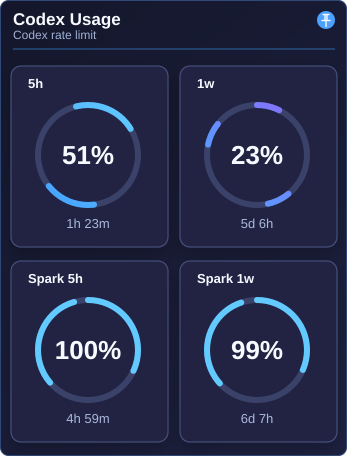

<p align="right"><a href="README.ko.md">🇰🇷 한국어 README</a></p>

# QuotaScope


QuotaScope is a small Windows tray utility for checking Codex and Claude usage limits without keeping each provider's app, CLI, or dashboard view open.

For Codex it starts `codex app-server` locally and reads rate limit data through stdio JSON-RPC. For Claude it reads the local Claude Code sign-in and polls Anthropic's usage endpoint. Results show in a compact tray popup.

## Screenshots

| Codex + Spark usage | Codex usage only |
|---|---|
|  |  |

## Features

- Windows system tray utility
- Compact usage popup
- Codex and Claude (Pro/Max) usage in one popup
- Payload-driven usage gauges: one row per rate-limit window the provider reports
- Optional secondary rows (GPT-5.3-Codex-Spark, Claude per-model windows)
- Optional credits rows (Codex credits balance, Claude extra usage)
- Tray icon shows the lowest remaining percent across providers
- Pinned popup mode
- Global hotkey: `Ctrl+Alt+U`
- Manual refresh and reconnect controls
- Position, time display, shape theme, and color theme settings
- Local settings persistence
- No separate credential required

## How it works

Codex:

1. The app starts `codex app-server` as a child process.
2. It initializes a stdio JSON-RPC session.
3. It calls `account/rateLimits/read`.
4. It listens for `account/rateLimits/updated` notifications.

Claude:

1. The app reads the access token from the local Claude Code credentials file (`%USERPROFILE%\.claude\.credentials.json`) on each poll. The token is never stored, copied, or logged.
2. It polls Anthropic's OAuth usage endpoint (the same data behind Claude Code's `/usage` command) at most once per 60 seconds.
3. On failure it keeps showing the last successful data marked as stale.

Each provider is isolated: one provider failing does not affect the other. The app does not collect telemetry.

## Requirements

- Windows
- Codex CLI / Codex app-server available through the `codex` command
- Claude Code signed in on this machine (optional, only for Claude usage)
- .NET 10 SDK for local development

Current project target:

```text
net10.0-windows
Windows Forms
```

## Run locally

From the repository root:

```powershell
dotnet run --project app/QuotaScope.csproj
```

Or from the app directory:

```powershell
cd app
dotnet run
```

Run the built-in mapper self-test:

```powershell
dotnet run --project app/QuotaScope.csproj -- --self-test
```

## Usage

- Left-click the tray icon to open or close the popup.
- Press `Ctrl+Alt+U` to toggle the popup.
- Use the pin button to keep the popup open.
- Right-click the tray icon or popup to open the menu.
- Use `Settings > Usage Rows > GPT-5.3 Spark` to show or hide Spark rows.
- Use `Settings > Usage Rows > Credits` to show or hide the credits balance row.
- Click the time text to switch between clock time and remaining time.

## Settings

The app stores local settings in `settings.json`.

Example:

```json
{
  "Hotkey": "Ctrl+Alt+U",
  "WarningThresholdPercent": 20,
  "PopupGraph": "half-circle",
  "PopupPosition": "BottomRight",
  "ShapeTheme": "Bars",
  "ColorTheme": "DarkBluePurple",
  "TimeDisplayMode": "ClockTime",
  "IsPinned": false,
  "Providers": {
    "codex": {
      "Enabled": true,
      "RefreshSeconds": 60,
      "ShowSecondaryRows": false,
      "ShowCredits": false,
      "Command": "codex"
    },
    "claude": {
      "Enabled": true,
      "RefreshSeconds": 60,
      "ShowSecondaryRows": false,
      "ShowCredits": false,
      "Command": "codex"
    }
  }
}
```

Notes:

- `TimeDisplayMode` can be `ClockTime` or `RemainingTime`.
- Provider options live under `Providers`, one entry per provider.
- `ShowSecondaryRows` enables secondary model rows (GPT-5.3-Codex-Spark, Claude per-model windows).
- `ShowCredits` enables the credits rows.
- `Command` is only used by the Codex provider.
- Claude polling is clamped to at least 60 seconds regardless of `RefreshSeconds`.
- The `Hotkey` setting exists in the settings file, but the current registered hotkey is fixed to `Ctrl+Alt+U`.

## Privacy

QuotaScope is designed as a local utility.

- It launches the local `codex app-server` process and communicates over stdio JSON-RPC.
- For Claude usage, it reads the local Claude Code credentials file and calls Anthropic's usage endpoint over HTTPS. This is the only point where the app talks to a remote service; it can be turned off by disabling the Claude provider.
- The Claude access token is read per poll for the request only and is never stored, copied, or logged by the app.
- It does not include telemetry, analytics, or remote logging.
- It stores settings locally.

## Current limitations

- Windows-only.
- The current UI is Windows Forms.
- The app depends on Codex app-server behavior and available rate limit fields.
- Claude usage relies on an undocumented Anthropic endpoint that may change or stop working without notice.
- Claude usage requires being signed in to Claude Code on the same machine.
- It is a local tray utility, not a cloud dashboard or analytics product.
- Packaging and installer distribution are not finalized yet.

## Roadmap

Near-term:

1. Stabilize the current Windows desktop tray experience.
2. Improve app icon, screenshots, README, and release notes.
3. Add a reproducible Windows build workflow.
4. Prepare a first tagged release.

Next major UI direction:

1. Evaluate or implement a WinUI 3 port.
2. Keep the Codex app-server integration and rate limit mapping behavior stable.
3. Rebuild the UI with a more modern native Windows app structure.
4. Re-evaluate packaging and distribution after the UI direction is settled.

Provider scope:

- The approved provider scope is Codex (OpenAI) and Claude (Anthropic).
- Both providers are implemented; no other providers are planned without explicit approval.

> This project was previously named `Codex Usage Tray` and was renamed to `QuotaScope` on 2026-07-22.

## Disclaimer

> This project is not affiliated with, endorsed by, or sponsored by OpenAI or Anthropic. Codex is a product/service of OpenAI. Claude is a product/service of Anthropic.

## Documentation

Project notes live under `docs/`.

- `docs/README.md`: operating notes and behavior details
- `docs/PROJECT_MAP.md`: module and file map
- `docs/MODERNIZATION_PLAN.md`: .NET / WinUI modernization plan
- `docs/modules/codex_rate_limits.md`: Codex app-server rate limit schema and mapping notes
- `docs/modules/claude_rate_limits.md`: Claude usage endpoint schema and mapping notes
