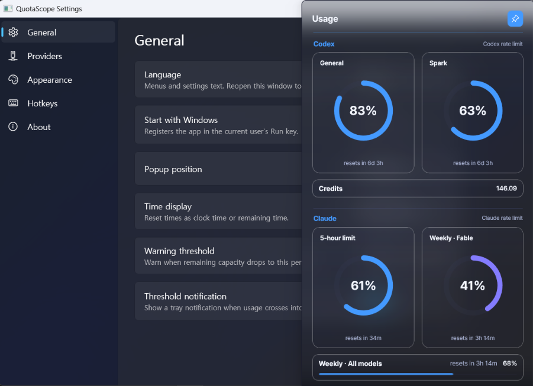
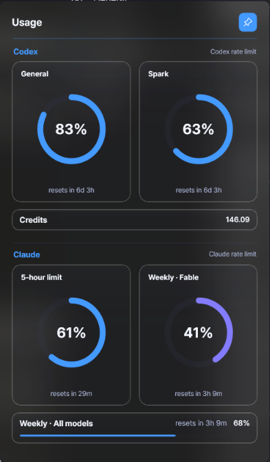
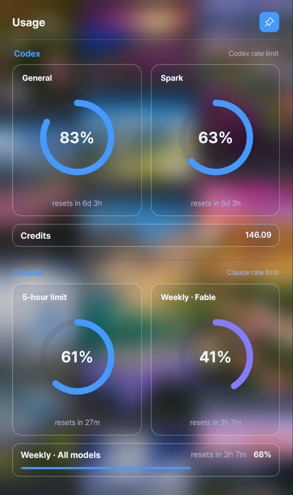
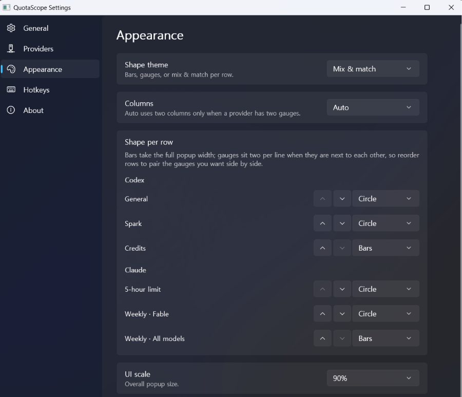

<p align="right"><a href="README.ko.md">🇰🇷 한국어 README</a></p>

# QuotaScope


QuotaScope is a small Windows tray utility for checking Codex and Claude usage limits without keeping each provider's app, CLI, or dashboard view open.

For Codex it starts `codex app-server` locally and reads rate limit data through stdio JSON-RPC. For Claude it reads the local Claude Code sign-in and polls Anthropic's usage endpoint. Results show in a compact tray popup.

## Screenshots



| Popup at 90% UI scale | Glassmorphism at 150% UI scale |
|---|---|
|  |  |

Layout is configurable per row — which rows show, gauges, bars, ordering, and column count:



## Install

1. Download `QuotaScope-win-x64.zip` from the [latest release](https://github.com/EvanHexX/quota-scope/releases/latest).
2. Extract it anywhere.
3. Run `QuotaScopeWinUI.exe`.

The build is self-contained: no .NET or Windows App SDK runtime install is required. Windows 11 is recommended (Windows 10 works, but the popup gets square corners instead of rounded ones).

## Features

- Windows system tray utility with a compact usage popup
- Codex and Claude (Pro/Max) usage side by side, in labeled per-provider sections
- Payload-driven rows: one row per rate-limit window the provider reports, so new windows (for example a per-model weekly limit) appear without an app update
- Pick the rows you want with a checkbox per row, with each provider keeping at least one
- Optional secondary rows (GPT-5.3-Codex-Spark 5h and weekly, Claude per-model windows) and credits rows
- Tray icon signals overall usage with an arc fill (5% steps) and a 3-level state color; the hover tooltip lists how much quota is left per window, and full numbers live in the popup
- Optional tray notification when usage crosses the warning threshold
- Layout: bars, gauges, or mix & match with a per-row shape and a forced one/two column mode
- Themes: Dark, Light, Midnight, optional system-theme following, and glassmorphism with four strength levels
- UI scale (80–150%) and English / Korean interface
- Configurable global hotkeys: toggle popup (default `Ctrl+Alt+U`), refresh all, toggle pin
- Dedicated settings window; pinned popup mode; start with Windows
- Local settings persistence; no separate credential required

## How it works

Codex:

1. The app starts `codex app-server` as a child process.
2. It initializes a stdio JSON-RPC session.
3. It calls `account/rateLimits/read`.
4. It listens for `account/rateLimits/updated` notifications.

Claude:

1. The app reads the access token from the local Claude Code credentials file (`%USERPROFILE%\.claude\.credentials.json`) on each poll. The token is never stored, copied, or logged.
2. It polls Anthropic's OAuth usage endpoint (the same data behind Claude Code's `/usage` command) at most once per 60 seconds.
3. Claude Code access tokens last 8 hours. Shortly before one expires the app runs `claude mcp list` in the background so Claude Code refreshes its own token; the app never performs the refresh itself and never writes to the credentials file. That command is read-only and consumes no usage.
4. On failure it keeps showing the last successful data marked as stale.

Each provider is isolated: one provider failing does not affect the other. The app does not collect telemetry.

## Requirements

- Windows 10 or later (Windows 11 recommended)
- Codex CLI / Codex app-server available through the `codex` command (optional, only for Codex usage)
- Claude Code signed in on this machine (optional, only for Claude usage)
- .NET 10 SDK only if you want to build from source

## Usage

- Left-click the tray icon to open or close the popup.
- Press `Ctrl+Alt+U` (or your own binding) to toggle the popup.
- Use the pin button to keep the popup open.
- Drag the popup header to move it.
- Click the time text to switch between clock time and remaining time.
- Right-click the tray icon for refresh, reconnect, settings, and exit.
- Right-click the popup for the same menu.

When Claude needs a sign-in, `Reconnect` opens a terminal running the Claude Code login flow; finish the browser sign-in and usage resumes automatically.

## Settings

Everything is configured in the settings window (tray icon → `Settings…`), applied immediately, and stored in `settings.json` next to the executable.

- **General**: language, start with Windows, popup position (including "last position"), time display, warning threshold, threshold notification
- **Providers**: per-provider enable, refresh interval, secondary rows, credits row, Codex command, Claude credential status, Claude session auto-renew, reconnect
- **Appearance**: shape theme (bars / gauges / mix & match), per-row shapes and column count, UI scale, theme, glassmorphism and its strength, tray icon style, gauge metric
- **Hotkeys**: toggle popup, refresh all, toggle pin — press a combination to bind; conflicts are reported inline and never saved silently
- **About**: version, disclaimer, repository link

Notes:

- Claude polling is clamped to at least 60 seconds regardless of the configured interval.
- Claude session auto-renew is on by default. Turn it off to keep the app from launching `claude` in the background; usage then stops when the 8-hour token expires until you sign in or reconnect.
- Gauges and percentages follow the gauge metric setting (used or remaining); state colors always key off usage.

## Privacy

QuotaScope is designed as a local utility.

- It launches the local `codex app-server` process and communicates over stdio JSON-RPC.
- For Claude usage, it reads the local Claude Code credentials file and calls Anthropic's usage endpoint over HTTPS. This is the only point where the app talks to a remote service; it can be turned off by disabling the Claude provider.
- The Claude access token is read per poll for the request only and is never stored, copied, or logged by the app.
- It does not include telemetry, analytics, or remote logging.
- It stores settings locally.

## Current limitations

- Windows-only.
- The app depends on Codex app-server behavior and the rate limit fields it exposes.
- Claude usage relies on an undocumented Anthropic endpoint that may change or stop working without notice.
- Claude usage requires being signed in to Claude Code on the same machine.
- It is a local tray utility, not a cloud dashboard or analytics product.
- No installer or auto-update yet; releases are portable zips.

## Provider scope

- The approved provider scope is Codex (OpenAI) and Claude (Anthropic).
- Both providers are implemented; no other providers are planned without explicit approval.

> This project was previously named `Codex Usage Tray` and was renamed to `QuotaScope` on 2026-07-22. The legacy Windows Forms app remains in the repository under `app/` while the WinUI 3 app in `app-winui/` is the released one.

## Build from source

```powershell
dotnet build app-winui/QuotaScope.WinUI.csproj
```

Run the built-in self-tests (rate limit mappers and the hotkey parser):

```powershell
dotnet run --project app-winui/QuotaScope.WinUI.csproj -- --self-test
```

Publish a self-contained build:

```powershell
dotnet publish app-winui/QuotaScope.WinUI.csproj -c Release -r win-x64 --self-contained true
```

## Disclaimer

> This project is not affiliated with, endorsed by, or sponsored by OpenAI or Anthropic. Codex is a product/service of OpenAI. Claude is a product/service of Anthropic.

## License

[MIT](LICENSE)

## Documentation

Project notes live under `docs/`.

- `docs/README.md`: operating notes and behavior details
- `docs/PROJECT_MAP.md`: module and file map
- `docs/MODERNIZATION_PLAN.md`: .NET / WinUI modernization plan
- `docs/WINUI3_PARITY.md`: WinUI 3 port notes, parity checklist, and window/backdrop findings
- `docs/modules/codex_rate_limits.md`: Codex app-server rate limit schema and mapping notes
- `docs/modules/claude_rate_limits.md`: Claude usage endpoint schema and mapping notes
